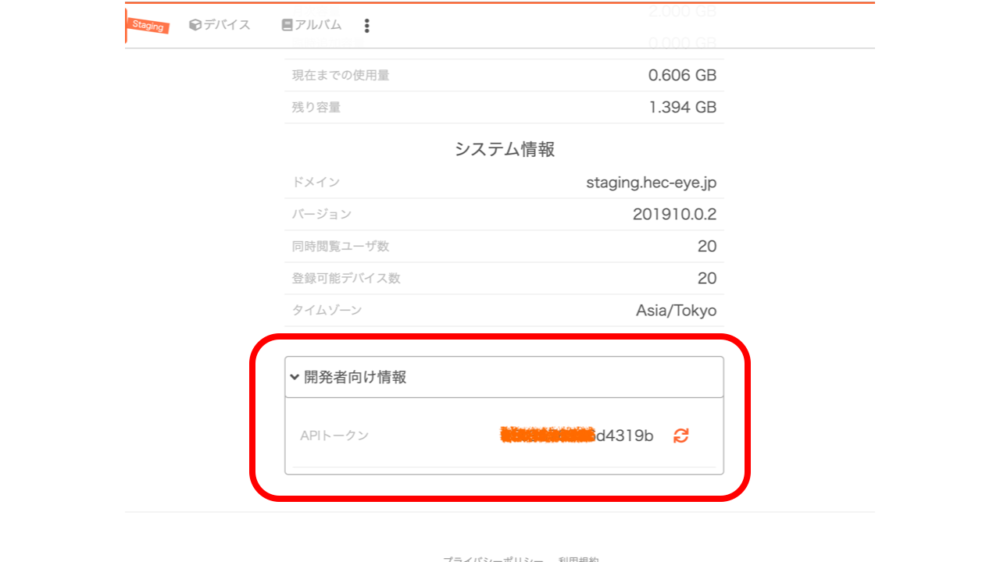

# 1. 入門

この document では Hec-Eye (Mapper) のデバイス連携に関する API 利用方法のサンプルについて記述したものです。

## api 利用方法のサンプル

### 共通設定

この document 内では、 api から各情報の request 方法についていくつかサンプルを例示します。
その時、共通した設定を行いますので以下を参考にしてください。

また、各変数については適宜環境に合わせて変更をしてください。

例

```sh
# 受け側の情報
domain="https://sandbox.hec-eye.jp"
apiToken="hogehoge"
deviceId="fugafuga"
```

`apiToken` と `deviceId` は、取得する手続きが必要です。
以下を参考にしてください。

#### APIトークンの取得方法

APIのトークンについては、Hec-Eye に管理者権限でログインをし、取得しなければなりません。
ログイン後に「アプリ情報画面」を開いて、下にある「開発者向け情報」を開くと表示されます。(画像の赤丸部分を参考にしてください。)



#### deviceId の取得方法

次のコマンドで、`domain` の Hec-Eye に登録されているデバイス全ての情報を取得出来ます。

```sh
# 受け側のURL作成
url="${domain}/api/devices?=${apiToken}"

# jsonの取得
curl -X GET "${url}"
```

返ってくる JSON 形式のデータに、それぞれのデバイスの詳細な情報が記されています。
返り値については、後述する [データの形式](#devices) を参考にしてください。

返り値にある目的のデバイスのデータから、デバイス固有の ID を利用してください。

### GET のサンプル

この document では、各デバイスから投稿した

- beacon
- photo
- video

の情報について、リクエスト方法について記述します。

```sh
# 受け側のURL作成
api="api/devices/${deviceId}/beacon"
url="${domain}/${api}?token=${apiToken}"

# jsonの取得
curl -X GET "${url}"
```

上記サンプルの `api` 記述部分については、 request したいものに適宜対応させ変更してください。
( 詳細については、後述の [api 一覧](#api-%e4%b8%80%e8%a6%a7) にあります。)

### POST のサンプル

Hec-Eye

```sh
# 受け側のURL作成
url="${domain}/api/devices/${deviceId}/beacon?token=${apiToken}"

# 投稿したいデータ
data='{
  "lat":35.70161,
  "lng":139.75319,
  "name":"Sample from API",
}'

# option
header="Content-Type: application/json"

# jsonの取得
curl -d "${data}" -H "${header}" -X POST "${url}"
```

### api 一覧

| Url                                | Verb | 説明                             |
| ---------------------------------- | ---- | -------------------------------- |
| `/api/devices`                     | GET  | Device の一覧習得                |
| `/api/devices/${deviceId}`         | GET  | Device の習得                    |
| `/api/devices/${deviceId}/beacons` | GET  | Device の投稿したビーコンを取得  |
| `/api/devices/${deviceId}/photos`  | GET  | Device の投稿した画像を取得      |
| `/api/devices/${deviceId}/videos`  | GET  | Device の投稿した写真を取得      |
| `/api/devices/${deviceId}/beacons` | POST | 設定した Device のビーコンを投稿 |

<br/>

## データの形式

データの形式については、特段利用するであろう項目について抜き出しています。
実際には後述する項目よりも多くのデータが返り値として渡されていますので、より詳細に知りたい場合は上記サンプルを実行の上で参照してください。

### Devices

```typescript
{
  id: string,
  createdAt: string,
  name: string,
  type: string,
},
```

各項目の詳細について

| 項目      | 説明                            |
| --------- | ------------------------------- |
| id        | 登録されているデバイス固有の ID |
| createdAt | デバイスが登録された日時        |
| name      | デバイス名                      |
| type      | 登録されているデバイスの情報    |

<div style="page-break-before:always"></div>

### Beacon

```typescript
{
  additional: {
    user: string,
    info: {
      hoge: string | number,
    }
  },
  alt: number,
  direction: number,
  lat: number,
  lng: number,
  type: string
}
```

各項目の詳細について

| 項目            | 説明                                       |
| --------------- | ------------------------------------------ |
| additional.user | 投稿者の情報                               |
| additional.info | デバイスで投稿したい任意の情報。(複数可能) |
| alt             | デバイスの高度情報                         |
| direction       | デバイスの向き                             |
| lat             | デバイスの位置する緯度                     |
| lng             | デバイスの位置する経度                     |
| type            | 登録したデバイスの設定情報                 |

<div style="page-break-before:always"></div>

### Video

```typescript
 {
  createdAt: string,
  duration: number,
  fileSize: number,
  fileType: string,
  id: string,
  imageHeight: number,
  imageWidth: number,
  lat: number,
  lng: number,
  name: string,
  tags: Array<string>,
  url: string,
}
```

各項目の詳細について

| 項目      | 説明                           |
| --------- | ------------------------------ |
| createdAt | 動画が投稿された日時           |
| duration  | 再生時間                       |
| fileSize  | 容量                           |
| fileType  | 拡張子                         |
| id        | 動画の固有 ID                  |
| lat       | 動画が投稿された位置情報(緯度) |
| lng       | 動画が投稿された位置情報(経度) |
| name      | 動画につけられた名前           |
| tags      | 関連付けされたタグ情報         |
| url       | 動画の URL                     |

<div style="page-break-before:always"></div>

### Photo

```typescript
{
  createdAt: string,
  id: string,
  lat: number,
  lng: number,
  name: string,
  tags: Array<string>,
  url: string,
}
```

各項目の詳細について

| 項目      | 説明                               |
| --------- | ---------------------------------- |
| createdAt | 画像が投稿された日時               |
| id        | 画像の固有 ID                      |
| lat       | 画像が投稿された位置情報(緯度)     |
| lng       | 画像が投稿された位置情報(経度)     |
| name      | 画像につけられた名前               |
| tags      | 関連付けされたタグ情報             |
| url       | 画像の URL (domain からの相対パス) |
